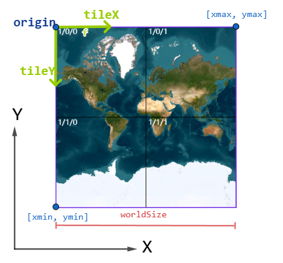

## vector-tile
由[Mapbox geojson-vt](https://github.com/mapbox/geojson-vt)修改而来 主要用于在浏览器端渲染

主要变更:<br/>
1.不关心坐标系，只需要保证**坐标**和**切片方案**在同一个二维平面坐标系中, geojson-vt只支持经纬度坐标<br/>
2.支持自定义切片方案 <br/>
3.支持动态修改数据, geojson-vt不支持修改<br/>
4.支持保留原始顶点以及索引，方便逐顶点数据获取<br/>

### examples
[see here](https://dengcheke.github.io/gis-vt/)

### [TileScheme 切片方案](#types-TileScheme) 
参考谷歌切片方案<br/>

```typescript
import {
    createTileScheme, 
    createTileSchemeWebMercator, 
    createTileSchemeFromBBoxAndZoom,
    createTileSchemeFromBBoxAndScale 
} from 'vector-tile';

// 创建 maxZoom = 24, tileSize = 256 的 WebMercator 切片方案
const tileScheme_3857 = createTileSchemeWebMercator(24, 256, 96);

// 等价于 => 
const tileScheme_3857 = createTileScheme({
    origin: [-20037508.3427892, 20037508.3427892],
    worldSize: 20037508.3427892 * 2,
    maxZoom: 24,
    tileSize: 256,
    wrapX: true,
    wrapY: false,
    dpi: 96
});

// 创建经纬度切片方案
const tileScheme_4326 = createTileScheme({
    origin: [-180, 90],
    worldSize: 360,
    maxZoom: 24,
    tileSize: 256,
    wrapX: true,
    wrapY: false,
    dpi: 96
});


// 数据范围(坐标系未知)为[xmin, ymin, xmax, ymax], 
// 比例尺为 1:10000 的切片方案
const tileScheme = createTileSchemeFromBBoxAndScale(
    [xmin, ymin, xmax, ymax]
    10000,
    {
        tileSize : 256,
        dpi : 96,
        wrapX : false,
        wrapY : false
    }
)


// 坐标范围(坐标系未知)为[0, 0, 100, 100], 
// 最大等级为 10 的切片方案
const tileScheme = createTileSchemeFromBBoxAndZoom(
    [0, 0, 100, 100],
    10,
    {
        tileSize: 256,
        dpi: 96,
        wrapX : false,
        wrapY : false
    }
);
```

### vector-tile 矢量切片

const vt = createVectorTile(options);

#### options
|prop|type|required|default|desc|
|:-|:-:|:-:|:-:|:--:|
|source|[InputFeature](#types)\[\]|✔️||输入要素|
|tileScheme|[TileScheme](#types-TileScheme)|✔️||切片方案|
|Q|number|||坐标量化值, 正整数, 如果存在, 则vt.getTileData输出坐标为量化后坐标|
|static|boolean||true|是否静态数据，<br/>true则不可编辑, vt.applyEdits不可用 ，<br/> false则数据可以变更, 但每个Feature必须指定唯一id|
|minZoom|number||0|限制数据zoom范围, 若超出范围，vt.getTileData 返回 null|
|maxZoom|number||tileScheme.maxZoom|限制数据zoom范围, 若超出范围，vt.getTileData 返回 null|
|indexMaxZoom|number||maxZoom/3|初始化时生成的最大瓦片zoom|
|indexMaxPoints|number||100000|初始化时生成的最大瓦片点数, 超过此值会继续向下分裂|
|tolerance|number||1|简化容差(像素), 用于要素简化|
|buffer|number||4/256|tile每个边向外扩张的比例(0-0.5之间), 默认4/256|
|simplifyAtMaxZoom|boolean||false|是否在maxZoom简化要素|
|keepPolygonPoint|boolean||false|是否保留polygon原始点, true则在裁剪时会保留原始点|
|keepPolygonPointIndex|boolean||false|是否保留polygon原始点对应的索引, 需要keepPolygonPoint同时为true<br/>启用时[VPolygon.vertexIndex](#types)有值|
|keepLinePoint|boolean||false|是否保留polyline原始点, true则在裁剪时会保留原始点|
|keepLinePointIndex|boolean||false|是否保留polyline原始点对应的索引, 需要keepLinePoint同时为true,<br/>启用时[VPolyline.vertexIndex](#types)有值|
|calcLineDistance|boolean||false|是否计算polyline每个点对应的距离<br/>为true时,则[VPolyline.distances & totalDistance](#types)和有值|
|multiLineDistanceStrategy|'stand-alone' \| 'cumulative'||false|multiLineString中每条线距离[VPolyline.totalDistance](#types)计算方式, 需要calcLineDistance为true<br/>stand-alone: 每条线就像LineString一样单独计算, 每条线的起点的距离为0<br/>cumulative: 线条距离累加, 每条线的起点的距离为上一条线的结尾距离<br/>可在Feature.properties 中单独设置|
|multiLineDistanceLink|boolean||false|cumulative模式下, 上条线的终点和下条线的起点之间的距离是否计算在内<br/>可在Feature.properties 中 单独设置|
|customSimplify|[CustomSimplify](#types)|||自定义简化函数, 返回值即为vt.getTileData.features|
|||||

#### vt实例方法:
||params|return|desc|
|:--:|:--:|:--:|:--:|
|getTileData|[TileXYZ](#types)     |[TileData](#types)| 若不存在则返回null |
|applyEdits |[VTEditParams](#types)|string[] |变化的瓦片key|
||||
```javascript
import { createVectorTile, createTileScheme } from "vector-tile";

const tileScheme_3857 = createTileSchemeWebMercator(24, 256, 96);

//加载数据
const geojson = await loadGeoJSON('river-4549.json'); 

//确保geojson数据和tileScheme在同一个坐标系中
const features = proj(geojson.features, 'EPSG:4549', 'EPSG:3857');

//创建矢量切片
const vt = createVectorTile({
    source: geojson.features,
    tileScheme: tileScheme_3857,
    static: false, 
});

//获取数据并渲染
const data = vt.getTileData({z:0, x:0, y:0}).features;
draw(data);


// 修改数据
vt.applyEdits({
    removes: [1, 2], // 移除 feature(id=1) 和 feature(id=2), 
    adds: [
        {id: 1000, type:'Feature', geometry:{...}, properties: {...}}, // 新增feature()
    ], 
    updates: [
        {id: 3, properties: {...}}, // 仅修改 feature(id=3) 的 properties
        {id: 4, properties: {...}, geometry:{...}}, // 同时修改 feature(id=4) 的 properties 和 geometry
    ]
});

//重新获取数据
const dataNew = vt.getTileData({z:0, x:0, y:0}).features;
draw(dataNew);
```


## interface 

<a id="types-TileScheme"></a>
```typescript
interface TileScheme {
    minZoom: number, // 最低等级
    maxZoom: number, // 最高等级
    origin: Coord, // 切片方案原点坐标, 左上角[xmin, ymax]
    tileSize: number[], // 瓦片大小（像素）
    //切片分级
    lods: {
        z: number,  // 等级
        resolution: number, // 分辨率 1像素 = resolution 个地图单位 
        scale: number // 比例尺
    }[],
    worldBBox: BBox, // 切片世界范围 [xmin, ymin, xmax, ymax]
    wrapX: boolean,  // x方向是否可环绕
    wrapY: boolean,  // y方向是否可环绕
    dpi: number,
}

interface Tile {
    key: string, // 标识符, 默认 z/y/x
    z: number,
    x: number,
    y: number,
    bbox: BBox, // 瓦片范围
    resolution: number,
    scale: number,
}
interface TileXYZ {
    z: number,
    x: number,
    y: number,
};
```


<a id="types"></a>
```typescript
import type { 
    BBox, Feature, LineString, 
    MultiLineString, MultiPoint, MultiPolygon, 
    Point, Polygon 
} from "geojson";

type Geo = Point | MultiPoint | LineString | MultiLineString | Polygon | MultiPolygon;
type InputFeature<G extends Geo | null = Geo> = Feature<G, {
    multiLineDistanceStrategy?: 'stand-alone' | 'cumulative',
    multiLineDistanceLink?: boolean
    [p: string]: any
}>;

interface TileXYZ {
    z: number,
    x: number,
    y: number,
};

interface TileData {
    version: number;      //版本, applyEdits后，如果数据变化， version会增加
    Q: number;            //量化值， 如果有
    features: VFeature[]; //如果Q存在，则坐标是量化后的坐标
    tile: Tile;           //瓦片
}


type VTEditParams = {
    adds?: InputFeature[],
    updates?: InputFeature[],
    removes?: (number | string)[],
};

interface VBase<T = any> {
    id: number | string;
    properties: T;
}

interface VPoint extends VBase {
    type: 'point';
    multiPointIndex: number; //如果数据源是 Multipoint，则表明是第几个点
    coordinates: Coord;
}

interface VPolyline extends VBase {
    type: 'polyline';
    multiLineStringIndex: number; // 如果数据源是MultiLineString, 则表明是第几条线
    coordinates: Path;
    bbox: BBox;
    vertexIndex: number[]; //每个点在当前线中是第几个点
    distances: number[];  //顶点距离
    totalDistance: number; //线总长
}

interface VPolygon extends VBase {
    type: 'polygon';
    multiPolygonIndex: number; // 如果数据源是MultiPolygon, 则表明是第几个面
    coordinates: Rings;
    bbox: BBox;
    vertexIndex: [
        number, // ringIndex  在当前Rings中是第几个ring
        number // vertexIndex 在对应ring中是第几个点
    ][][]; //每个点对应的索引
}

type VFeature = VPoint | VPolygon | VPolyline;

type CustomSimplify = (
    raws: VFeature[], 
    tile: Tile, 
    option: VTOption, 
    isEdit: boolean，//是否是applyEdits
) => VFeature[];

```